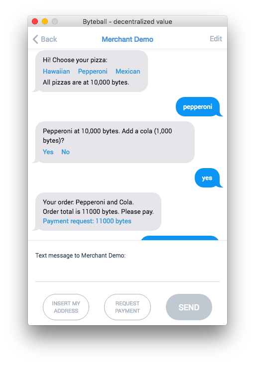
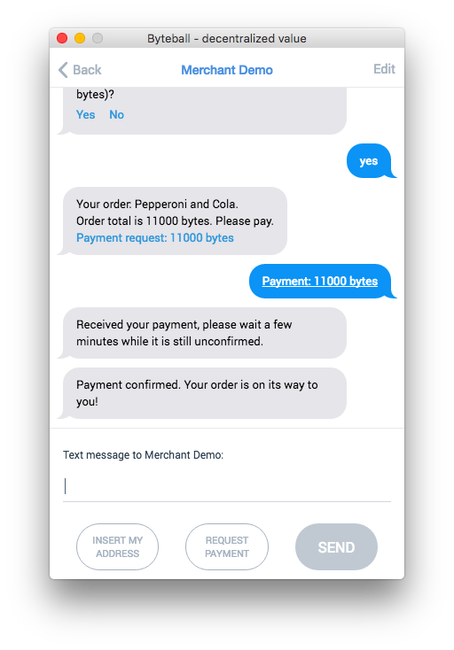

# Chatbot merchant for O<sub>byte</sub> network

This is a demo of a merchant that sells stuff in chat interface.  If you want to sell something for bytes, blackbytes, or another asset, use this demo as a template.

A typical dialog with the chatbot looks like this:

 

The merchant runs as a daemon and it doesn't hold any private keys.  Instead, it knows only the extended public key and uses it to generate a new receiving address for each order.  The addresses are automatically synced with the home wallet that actually holds the private key and can spend the money collected from sales.

## Install

Install node.js, clone the repository, then say
```sh
npm install
```

## Edit settings

Before you run the chatbot for the first time, edit these settings in [conf.js](conf.js) or in conf.json in the app data folder:

* `hub`: hub address without wss://, the default is `obyte.org/bb`.
* `deviceName`: the name of your bot as seen in the chat interface.
* `permanent_paring_secret`: the pairing secret used to authenticate pairing requests from customers.  Since you want to chat with any potential buyer, it is not really a secret, so use something simple like 0000.  The pairing secret is the part of the pairing code after #.
* `xPubKey`: extended public key of the home wallet that is to collect funds.  To find it out, open the [GUI wallet](../../../obyte-gui-wallet), click gear icon -> Advanced -> Wallet Information, look for "Extended public keys", double-click to select it (it starts with "xpub"), copy and paste into the conf.
* `account`: account number of the home wallet.  Find it out like `xPubKey` above but look for "Account (BIP44)".  The BIP44 derivation path of addresses is `m/44'/0'/account'/is_change/address_index`.
* `homeDeviceAddress`: device address of the home wallet.  Find it out by opening the Wallet, clicking menu button -> Global preferences, look for "Device address".

## Run
```sh
node merchant.js > log &
```
The first time you run the bot, it will take a while to sync with the network.

While it syncs, add the merchant-specific table and indexes [merchant.sql](merchant.sql) to its sqlite database by opening byteball.sqlite (located in app data folder) with any sqlite client (e.g. [Command Line Shell For SQLite](https://www.sqlite.org/cli.html) or [SQLite browser](http://sqlitebrowser.org/)) and executing the SQL in [merchant.sql](merchant.sql).

When the daemon starts, it prints out its pairing code (see it in the first lines of the log file).  You should copy the code and put it on your site or send to any potential customers.  This code allows anyone to connect with the chatbot and start a chat.

Before you can sell stuff, pair the chatbot with its home wallet (the wallet that collects revenue from sales).  When you do this, a copy of your home wallet (without private keys) is created in the chatbot and synced with the home wallet.  After this point, the chatbot is ready to accept payments, and you will immediately see the payments in your home wallet.

## TOR

You can configure the merchant to connect to peers through TOR (see [conf.socksHost, conf.socksPort, and conf.socksLocalDNS](../../../ocore#confsockshost-confsocksport-and-confsockslocaldns)) in order to hide its IP address.  Your customers don't need to run TOR.

## Customize

If you want to change any defaults, refer to the documentation of [ocore](../../../ocore), the core O<sub>byte</sub> library `require()`'d from here.

